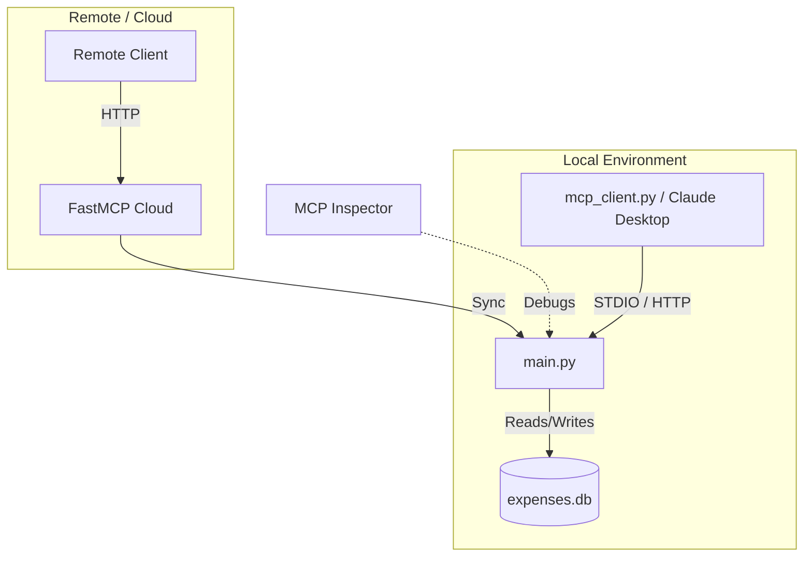

# Expense Tracker MCP Server

Accountable and simple expense tracking server built with the Model Context Protocol (MCP). This project demonstrates how to build, test, deploy, and consume an MCP server.

## ❓ Why FastMCP?

You might wonder why we use **FastMCP** instead of the standard low-level `mcp` SDK.

| Feature | FastMCP 🚀 | Standard MCP SDK 🛠️ |
| :--- | :--- | :--- |
| **Abstractions** | High-level, decorator-based (like FastAPI) | Low-level, explicit protocol handling |
| **Boilerplate** | Minimal | High (requires manual setup of sessions/streams) |
| **Dev Tools** | Built-in **MCP Inspector** UI | Requires separate setup |
| **Deployment** | One-click **FastMCP Cloud** integration | Manual deployment configuration |
| **Use Case** | Rapid development, simple to medium complexity | Complex, custom protocol implementations |

**In short:** FastMCP handles the heavy lifing (logging, error handling, protocol negotiations) so you can focus on writing your tools.

## 📂 Project Structure

- **`main.py`**: The core MCP server implementation using `FastMCP`. It manages the SQLite database and exposes tools (`add_expense`, `list_expenses`, `summarize`) and resources (`categories`).
- **`mcp_client.py`**: A sample Python client using `langchain-mcp-adapters` to connect to and interact with the MCP server programmatically.
- **`proxy.py`**: A proxy script to connect local clients to a remote FastMCP Cloud deployment.
- **`expenses.db`**: Local SQLite database storing all expense records (created automatically in the current directory).
- **`categories.json`**: Configuration file for expense categories (optional).

## 🏗️ Architecture



## 🚀 How to Create an MCP Server

This server is built using `fastmcp`. The core logic is in `main.py`.
1.  Initialize `FastMCP("ServerName")`.
2.  Decorate functions with `@mcp.tool()` to expose them as tools.
3.  Decorate functions with `@mcp.resource()` to expose data resources.
4.  Run with `mcp.run()`.

## 🛠️ How to Check Locally

### 1. Run the Server
You can run the server in two modes:

**Option A: HTTP Server (Default)**
Best for remote connections, cloud deployment, or multiple local clients.
```bash
uv run main.py
```
*Starts on http://0.0.0.0:8000/sse*

**Option B: STDIO (Standard Input/Output)**
Best for use with Claude Desktop app or local agents.
```bash
uv run fastmcp run main.py
```
*Listens on stdin/stdout. No logs will appear to avoid corrupting the protocol.*

### 2. Verify with Client Script
Open a new terminal and run the client:
```bash
uv run mcp_client.py
```
*Ensure `mcp_client.py` is configured for the correct transport (see below).*

## 🔍 How to Check in MCP Inspector

The MCP Inspector is a visual debugging tool.

**For HTTP Server:**
```bash
uv run fastmcp dev main.py --transport http
```

**For STDIO Server:**
```bash
uv run fastmcp dev main.py
```

## ☁️ How to Deploy in MCP Cloud

1.  Go to [FastMCP Cloud](https://fastmcp.cloud).
2.  Login and create a new server.
3.  Deploy your code (you can connect your GitHub repository).
4.  Once deployed, you will get a **Server URL**.
5.  Use `proxy.py` to connect local tools to your cloud instance.

## 🔌 How to Create a Client

See `mcp_client.py` for a complete example. You can connect via correct transport:

**Example: Connecting via HTTP**
```python
"expense": {
    "transport": "sse",
    "url": "http://localhost:8000/sse"
}
```

**Example: Connecting via STDIO**
```python
"expense": {
    "transport": "stdio",
    "command": "uv",
    "args": ["run", "fastmcp", "run", "main.py"]
}
```

## 🤖 How to Install in Claude Desktop

To use this server with the Claude Desktop app (Requires STDIO):

1.  Open the config file:
    -   **Windows**: `%APPDATA%\Claude\claude_desktop_config.json`
    -   **Mac**: `~/Library/Application Support/Claude/claude_desktop_config.json`

2.  Add the configuration:

```json
{
  "mcpServers": {
    "expense-tracker": {
      "command": "uv",
      "args": [
        "run",
        "fastmcp",
        "run",
        "d:\\Dharmesh\\MCP\\test_remote_server\\main.py"
      ]
    }
  }
}
```
*Note: We use `fastmcp run` to ensure it speaks the correct STDIO protocol, as running `main.py` directly would start an HTTP server and break the connection.*

